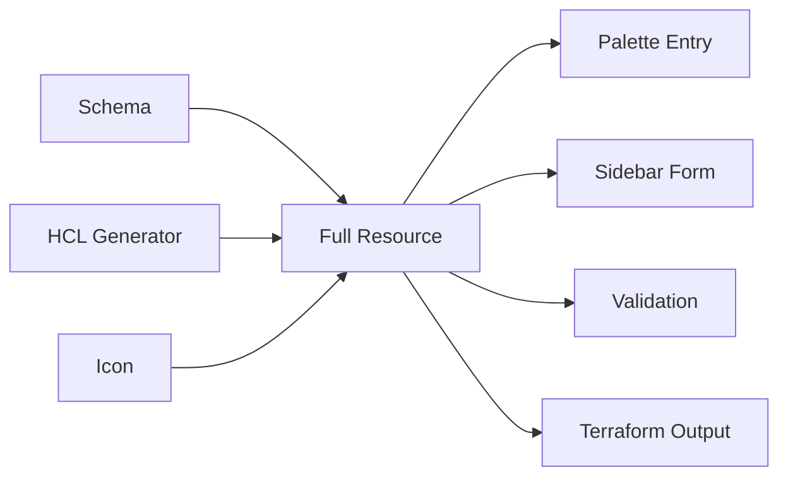

# Building TerraStudio with AI

**Afroze Amjad**

Associate Director Engineering

---

# What This Session Covers

<v-clicks>

- Can one developer + AI build a production-grade desktop app from scratch?
- What breaks when AI writes 80% of the code?
- Hard numbers: velocity, bugs, cost, and the "fix tax"
- Key takeaways

</v-clicks>


---
transition: none
---


# The Challenge
<v-click>
Build a full desktop infrastructure-as-code visual editor + CLI from zero
</v-click>
---
transition: none
---

# The Challenge

## Visual Canvas for Designing Architectures

Drag-and-drop Azure/AWS resources onto an interactive canvas with connections, containers, and real-time validation.

<div class="flex justify-center mt-4">
  <div class="w-3/4 h-64 bg-gray-100 rounded-lg flex items-center justify-center text-gray-400 border-2 border-dashed border-gray-300">
    <span class="text-lg">Screenshot: Canvas View</span>
  </div>
</div>

---
transition: none
---

# The Challenge

## Terraform HCL Generation & Plan Visualization

Generate production-ready Terraform code, execute plans, and visualize changes — all from the UI.

<div class="flex justify-center mt-4">
  <div class="w-3/4 h-64 bg-gray-100 rounded-lg flex items-center justify-center text-gray-400 border-2 border-dashed border-gray-300">
    <span class="text-lg">Screenshot: HCL Generation / Plan View</span>
  </div>
</div>

---
transition: none
---

# The Challenge

## 72+ Cloud Resources, Multi-Cloud Plugins

Schema-driven plugin system supporting Azure (50+), AWS (14+), and Azure AI (8) resources with cost estimation and modules.

<div class="flex justify-center mt-4">
  <div class="w-3/4 h-64 bg-gray-100 rounded-lg flex items-center justify-center text-gray-400 border-2 border-dashed border-gray-300">
    <span class="text-lg">Screenshot: Resource Palette / Multi-Cloud</span>
  </div>
</div>

---
transition: none
---

# The Challenge

## i18n & Accessibility

6 languages, WCAG AA compliance, ARIA labels, and font scaling.

<div class="flex justify-center mt-4">
  <div class="w-3/4 h-64 bg-gray-100 rounded-lg flex items-center justify-center text-gray-400 border-2 border-dashed border-gray-300">
    <span class="text-lg">Screenshot: i18n / Accessibility</span>
  </div>
</div>

---
transition: slide-left
---

# The Challenge

## CLI with Binary Distribution

Full CLI with HCL generation, project creation wizard, terraform commands, and native binary packaging.

<div class="flex justify-center mt-4">
  <div class="w-3/4 h-64 bg-gray-100 rounded-lg flex items-center justify-center text-gray-400 border-2 border-dashed border-gray-300">
    <span class="text-lg">Screenshot: CLI</span>
  </div>
</div>

---

# The Traditional Way

Building this without AI — estimated timeline for a small team:

<div class="mt-6 space-y-3">
  <div class="flex items-center gap-3">
    <div class="w-44 text-right text-sm font-medium">Full-stack Dev</div>
    <div class="relative h-8 flex-1">
      <div class="absolute inset-y-0 left-0 w-full bg-gray-100 rounded" />
      <div class="absolute inset-y-0 left-0 rounded flex items-center pl-3 text-white text-xs font-bold" style="width: 100%; background: linear-gradient(90deg, #2563eb, #1d4ed8);">4–6 months</div>
    </div>
  </div>
  <div class="flex items-center gap-3">
    <div class="w-44 text-right text-sm font-medium">UI / UX</div>
    <div class="relative h-8 flex-1">
      <div class="absolute inset-y-0 left-0 w-full bg-gray-100 rounded" />
      <div class="absolute inset-y-0 left-0 rounded flex items-center pl-3 text-white text-xs font-bold" style="width: 50%; background: linear-gradient(90deg, #7c3aed, #6d28d9);">2–3 months</div>
    </div>
  </div>
  <div class="flex items-center gap-3">
    <div class="w-44 text-right text-sm font-medium">Cloud Architect</div>
    <div class="relative h-8 flex-1">
      <div class="absolute inset-y-0 left-0 w-full bg-gray-100 rounded" />
      <div class="absolute inset-y-0 left-0 rounded flex items-center pl-3 text-white text-xs font-bold" style="width: 33%; background: linear-gradient(90deg, #0891b2, #0e7490);">1–2 months</div>
    </div>
  </div>
  <div class="flex items-center gap-3">
    <div class="w-44 text-right text-sm font-medium">DevOps / CI</div>
    <div class="relative h-8 flex-1">
      <div class="absolute inset-y-0 left-0 w-full bg-gray-100 rounded" />
      <div class="absolute inset-y-0 left-0 rounded flex items-center pl-3 text-white text-xs font-bold" style="width: 33%; margin-left: 33%; background: linear-gradient(90deg, #ea580c, #c2410c);">1–2 months</div>
    </div>
  </div>
  <div class="flex items-center gap-3">
    <div class="w-44 text-right text-sm font-medium">QA / Testing</div>
    <div class="relative h-8 flex-1">
      <div class="absolute inset-y-0 left-0 w-full bg-gray-100 rounded" />
      <div class="absolute inset-y-0 left-0 rounded flex items-center pl-3 text-white text-xs font-bold" style="width: 83%; margin-left: 17%; background: linear-gradient(90deg, #16a34a, #15803d);">Ongoing</div>
    </div>
  </div>
  <div class="flex items-center gap-3 mt-1">
    <div class="w-44" />
    <div class="flex-1 flex justify-between text-xs text-gray-400 px-1">
      <span>Month 1</span><span>Month 2</span><span>Month 3</span><span>Month 4</span><span>Month 5</span><span>Month 6+</span>
    </div>
  </div>
</div>

<v-click>

<div class="text-center text-2xl mt-4 font-bold0">
  We did it in 33 days
</div>

</v-click>

---

# The Journey: 33 Days, 5 Weeks

<div class="flex gap-6 h-96">
<div class="flex flex-col items-center">
  <div class="w-4 h-4 rounded-full bg-white ring-4 ring-gray-500 z-10" />
  <div class="w-0.5 flex-1 bg-gray-500" />
  <div class="w-4 h-4 rounded-full bg-white ring-4 ring-gray-500 z-10" />
  <div class="w-0.5 flex-1 bg-gray-500" />
  <div class="w-4 h-4 rounded-full bg-white ring-4 ring-gray-500 z-10" />
  <div class="w-0.5 flex-1 bg-gray-500" />
  <div class="w-4 h-4 rounded-full bg-white ring-4 ring-gray-500 z-10" />
  <div class="w-0.5 flex-1 bg-gray-500" />
  <div class="w-4 h-4 rounded-full bg-white ring-4 ring-gray-500 z-10" />
</div>
<div class="flex flex-col justify-between text-sm">
  <div>
    <div class="font-bold">Week 1</div>
    <div class="opacity-80">Monorepo scaffold, 48-commit marathon, containers, undo/redo, theming, 20+ Azure resources</div>
  </div>
  <div>
    <div class="font-bold">Week 2</div>
    <div class="opacity-80">Cost estimation, MCP server, multi-window, modules, templates</div>
  </div>
  <div>
    <div class="font-bold">Week 3</div>
    <div class="opacity-80">AWS plugin (14 resources), i18n, accessibility, dependency graph</div>
  </div>
  <div>
    <div class="font-bold">Week 4</div>
    <div class="opacity-80">Naming system collapse (7 fixes), CLI extraction, release pipeline hell (21 fixes)</div>
  </div>
  <div>
    <div class="font-bold">Week 5</div>
    <div class="opacity-80">Resource audit (30 issues found), Azure AI plugin, CLI wizard</div>
  </div>
</div>
</div>

<v-click>

**Weeks 1-3**: 28% fix rate. **Weeks 4-5**: 47% fix rate. 48 versions shipped.

</v-click>

---

# The Journey: Interactive Timeline

<div class="flex items-center gap-12 mt-8">
  
  <div>
    <a href="https://afrozeamjad.com/projects/terrastudio/timeline.html" target="_blank" class="text-xl underline">
      Open Interactive Timeline
    </a>
  </div>
</div>

---

# The Ship-Then-Fix Pattern

Every major feature followed this cadence:

<div class="flex flex-col items-center gap-1 mt-4">
  <div class="px-4 py-1.5 rounded bg-green-500/20 border border-green-500/40 font-bold text-sm">Ship feature (1-2 commits)</div>
  <div class="opacity-40">↓</div>
  <div class="px-4 py-1.5 rounded bg-red-500/20 border border-red-500/40 font-bold text-sm">Discover 2-5 issues</div>
  <div class="opacity-40">↓</div>
  <div class="px-4 py-1.5 rounded bg-yellow-500/20 border border-yellow-500/40 font-bold text-sm">Fix in rapid succession</div>
  <div class="opacity-40">↓</div>
  <div class="px-4 py-1.5 rounded opacity-40 border border-current text-sm">Move on → repeat</div>
</div>

**16 instances** of 2+ consecutive fix commits following a feature across the project.

---

# The Naming Convention Collapse

Adding a "Display Name" field created a **circular dependency** — 7 consecutive fixes:

```
feat: add display name field
fix: replace checkbox with toggle           ← 1
fix: inherit naming tokens from parent RG   ← 2
fix: remove redundant field, fix feedback loop ← 3
fix: decouple slug from computed name       ← 4
fix: restore naming_region shortcode        ← 5
fix: keep label in sync with slug           ← 6
fix: propagate RG overrides to child nodes  ← 7
```

Slug derived from name. Name derived from slug. Label derived from both.
Each fix broke a different direction of the cycle.

---

# The npm Publish Saga

Adding CLI publishing to the release pipeline: **21 fix commits, zero features**

<div class="grid grid-cols-2 gap-4">
<div>

```
fix: direct pkg path (npm conflict)
fix: switch to OIDC trusted publishing
fix: rename to @afroze9/terrastudio-cli
fix: remove email from author
fix: track CLI in release-please
fix: remove manual release trigger
fix: gate jobs on desktop release
fix: force release-please PR
fix: unblock after tagging v0.41.3
fix: job-level id-token permission
```

</div>
<div>

```
fix: remove --provenance (%2f bug)
fix: Node 24 for OIDC provenance
fix: add repository url for provenance
fix: bump to 0.41.7 and align versions
...and 7 more
```

<br>

Version jumped **v0.41.0 → v0.41.7**
with **zero feature changes**.

7 patch versions of pure CI fighting.

</div>
</div>

---

# The Eureka Moment

Once the schema-driven plugin system clicked, adding resources became **mechanical**:

<div class="grid grid-cols-2 gap-8">
<div>



</div>
<div>

<v-clicks>

- i18n (6 languages) — **1 commit**
- Accessibility (WCAG AA) — **3 commits**
- MCP server — **1 commit**
- AWS plugin (14 resources) — **4 commits**
- Azure AI plugin (8 resources) — **2 commits**

</v-clicks>

</div>
</div>

<v-click>

**But**: the resource audit at v0.42 found **~30 schema issues** across 64+ resources.
Speed created silent quality debt that only appeared under systematic review.

</v-click>

---


# Where AI Failed — Every Time

<v-clicks>

<div class="flex items-center gap-3 px-4 py-2 rounded-lg border border-red-500/30 bg-red-500/10 mt-2">
  <div class="font-bold text-sm w-52">Platform Blind Spots</div>
  <div class="opacity-70 text-xs flex-1">WebView2 DnD, Svelte 5 proxies, CJS/ESM</div>
  <div class="font-bold text-red-400 text-xs">12+ fixes</div>
</div>

<div class="flex items-center gap-3 px-4 py-2 rounded-lg border border-red-500/30 bg-red-500/10 mt-2">
  <div class="font-bold text-sm w-52">Wrong Architecture</div>
  <div class="opacity-70 text-xs flex-1">canContain → canBeChildOf, naming cycles</div>
  <div class="font-bold text-red-400 text-xs">9 rewrites</div>
</div>

<div class="flex items-center gap-3 px-4 py-2 rounded-lg border border-red-500/30 bg-red-500/10 mt-2">
  <div class="font-bold text-sm w-52">No Security Instinct</div>
  <div class="opacity-70 text-xs flex-1">HCL injection shipped for 12 versions</div>
  <div class="font-bold text-red-400 text-xs">Retrofitted</div>
</div>

<div class="flex items-center gap-3 px-4 py-2 rounded-lg border border-red-500/30 bg-red-500/10 mt-2">
  <div class="font-bold text-sm w-52">Cascading Blindness</div>
  <div class="opacity-70 text-xs flex-1">Module nodes leaked into every pipeline</div>
  <div class="font-bold text-red-400 text-xs">6 fixes</div>
</div>

<div class="flex items-center gap-3 px-4 py-2 rounded-lg border border-red-500/30 bg-red-500/10 mt-2">
  <div class="font-bold text-sm w-52">No Testing Initiative</div>
  <div class="opacity-70 text-xs flex-1">3 test commits out of 338 (0.9%)</div>
  <div class="font-bold text-red-400 text-xs">30 audit issues</div>
</div>

<div class="flex items-center gap-3 px-4 py-2 rounded-lg border border-red-500/30 bg-red-500/10 mt-2">
  <div class="font-bold text-sm w-52">CI/CD Incompetence</div>
  <div class="opacity-70 text-xs flex-1">npm publish saga</div>
  <div class="font-bold text-red-400 text-xs">21 fixes</div>
</div>

</v-clicks>

<v-click>

<div class="text-center mt-4">

AI chose the wrong architecture **9 out of 9 times** when left to its own judgment.

</div>

</v-click>

---

# Before and After

<div class="grid grid-cols-2 gap-4 mt-2">
<div class="text-center font-bold opacity-60 text-sm">With AI</div>
<div class="text-center font-bold opacity-60 text-sm">Without AI</div>
</div>

<v-clicks>

<div class="grid grid-cols-2 gap-4 mt-2">
  <div class="flex items-center gap-3 px-4 py-2 rounded-lg border border-green-500/30 bg-green-500/10">
    <div class="font-bold text-sm w-44">Time to product</div>
    <div class="font-bold text-green-400 text-sm">33 days</div>
  </div>
  <div class="flex items-center gap-3 px-4 py-2 rounded-lg border border-gray-500/30 bg-gray-500/10">
    <div class="font-bold text-sm w-44">Time to product</div>
    <div class="opacity-70 text-sm">3-9 months</div>
  </div>
</div>

<div class="grid grid-cols-2 gap-4 mt-2">
  <div class="flex items-center gap-3 px-4 py-2 rounded-lg border border-green-500/30 bg-green-500/10">
    <div class="font-bold text-sm w-44">Human hours</div>
    <div class="font-bold text-green-400 text-sm">~80-100 hrs*</div>
  </div>
  <div class="flex items-center gap-3 px-4 py-2 rounded-lg border border-gray-500/30 bg-gray-500/10">
    <div class="font-bold text-sm w-44">Human hours</div>
    <div class="opacity-70 text-sm">1,500-3,000 hrs</div>
  </div>
</div>

<div class="grid grid-cols-2 gap-4 mt-2">
  <div class="flex items-center gap-3 px-4 py-2 rounded-lg border border-green-500/30 bg-green-500/10">
    <div class="font-bold text-sm w-44">Features shipped</div>
    <div class="font-bold text-green-400 text-sm">48 versions, 72+ resources</div>
  </div>
  <div class="flex items-center gap-3 px-4 py-2 rounded-lg border border-gray-500/30 bg-gray-500/10">
    <div class="font-bold text-sm w-44">Features shipped</div>
    <div class="opacity-70 text-sm">Same scope</div>
  </div>
</div>

<div class="grid grid-cols-2 gap-4 mt-2">
  <div class="flex items-center gap-3 px-4 py-2 rounded-lg border border-red-500/30 bg-red-500/10">
    <div class="font-bold text-sm w-44">Bug rate</div>
    <div class="font-bold text-red-400 text-sm">33% fix commits</div>
  </div>
  <div class="flex items-center gap-3 px-4 py-2 rounded-lg border border-gray-500/30 bg-gray-500/10">
    <div class="font-bold text-sm w-44">Bug rate</div>
    <div class="opacity-70 text-sm">~10-15%</div>
  </div>
</div>

<div class="grid grid-cols-2 gap-4 mt-2">
  <div class="flex items-center gap-3 px-4 py-2 rounded-lg border border-red-500/30 bg-red-500/10">
    <div class="font-bold text-sm w-44">Test coverage</div>
    <div class="font-bold text-red-400 text-sm">0.9%</div>
  </div>
  <div class="flex items-center gap-3 px-4 py-2 rounded-lg border border-gray-500/30 bg-gray-500/10">
    <div class="font-bold text-sm w-44">Test coverage</div>
    <div class="opacity-70 text-sm">40-70%</div>
  </div>
</div>

<div class="grid grid-cols-2 gap-4 mt-2">
  <div class="flex items-center gap-3 px-4 py-2 rounded-lg border border-red-500/30 bg-red-500/10">
    <div class="font-bold text-sm w-44">Arch rewrites</div>
    <div class="font-bold text-red-400 text-sm">9</div>
  </div>
  <div class="flex items-center gap-3 px-4 py-2 rounded-lg border border-gray-500/30 bg-gray-500/10">
    <div class="font-bold text-sm w-44">Arch rewrites</div>
    <div class="opacity-70 text-sm">1-2</div>
  </div>
</div>

</v-clicks>

---

# Takeaway 1: AI Is a Brilliant Junior Dev

AI produces incredible velocity but requires a human to catch every:

<div class="mt-4 space-y-3">
<v-clicks>
  <div class="flex items-center gap-4 px-5 py-3 rounded-xl bg-gray-500/15 border border-gray-500/30 ml-0">
    <div class="font-bold text-sm w-44">Architectural mistakes</div>
    <div class="text-sm opacity-80">9 wrong abstractions — wrong every time when left to its own judgment</div>
  </div>
  <div class="flex items-center gap-4 px-5 py-3 rounded-xl bg-gray-500/15 border border-gray-500/30 ml-8">
    <div class="font-bold text-sm w-44">Security vulnerabilities</div>
    <div class="text-sm opacity-80">HCL injection shipped undetected for 12 versions</div>
  </div>
  <div class="flex items-center gap-4 px-5 py-3 rounded-xl bg-gray-500/15 border border-gray-500/30 ml-16">
    <div class="font-bold text-sm w-44">Platform quirks</div>
    <div class="text-sm opacity-80">WebView2, CJS/ESM, npm OIDC — blind spots in every runtime</div>
  </div>
  <div class="flex items-center gap-4 px-5 py-3 rounded-xl bg-gray-500/15 border border-gray-500/30 ml-24">
    <div class="font-bold text-sm w-44">Cascading failures</div>
    <div class="text-sm opacity-80">Module nodes, naming cycles — fixes locally, breaks globally</div>
  </div>
</v-clicks>
</div>

<v-click>

<div class="flex gap-8 mt-6 items-center">
  <div class="px-5 py-2 rounded-lg bg-gray-500/15 border border-gray-500/30 text-center">
    <div class="text-xs opacity-60">Weeks 1-3</div>
    <div class="font-bold">28% fixes</div>
  </div>
  <div class="text-xl opacity-30">→</div>
  <div class="px-5 py-2 rounded-lg bg-gray-500/15 border border-gray-500/30 text-center">
    <div class="text-xs opacity-60">Weeks 4-5</div>
    <div class="font-bold">47% fixes</div>
  </div>
  <div class="text-sm opacity-70 ml-4">Velocity erodes when you move from building to hardening.</div>
</div>

</v-click>

---

# Takeaway 2: Architecture Is the New Bottleneck

The optimal approach is **architect-led, AI-accelerated development**:

<div class="mt-4 space-y-3">
<v-clicks>
  <div class="flex items-center gap-4 px-5 py-3 rounded-xl bg-blue-500/15 border border-blue-500/30 ml-0">
    <div class="font-bold text-sm w-20">Human</div>
    <div class="text-sm opacity-80">Design the architecture, security model, and CI pipeline</div>
  </div>
  <div class="flex items-center gap-4 px-5 py-3 rounded-xl bg-green-500/15 border border-green-500/30 ml-12">
    <div class="font-bold text-sm w-20">AI</div>
    <div class="text-sm opacity-80">Implement features at 10x speed</div>
  </div>
  <div class="flex items-center gap-4 px-5 py-3 rounded-xl bg-yellow-500/15 border border-yellow-500/30 ml-24">
    <div class="font-bold text-sm w-20">CI</div>
    <div class="text-sm opacity-80">Enforce tests and linting automatically</div>
  </div>
  <div class="flex items-center gap-4 px-5 py-3 rounded-xl bg-blue-500/15 border border-blue-500/30 ml-36">
    <div class="font-bold text-sm w-20">Human</div>
    <div class="text-sm opacity-80">Review before merge</div>
  </div>
  <div class="flex items-center gap-4 px-5 py-3 rounded-xl bg-purple-500/15 border border-purple-500/30 ml-48">
    <div class="font-bold text-sm w-20">Audit</div>
    <div class="text-sm opacity-80">Catch accumulated quality debt periodically</div>
  </div>
</v-clicks>
</div>

<v-click>

<div class="text-center mt-8 text-lg">

> The 33% fix tax is the price of velocity — and it compounds as complexity grows.
> The question isn't whether to pay it — it's whether your architecture and testing strategy can keep it from becoming the dominant cost.

</div>

</v-click>

---
class: text-center
---

# Questions?

<br>

**TerraStudio**: github.com/afroze9/terrastudio

**This Analysis**: github.com/afroze9/terrastudio-devhistory
